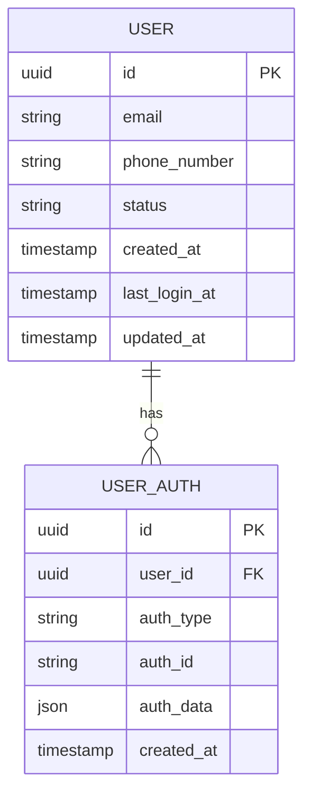
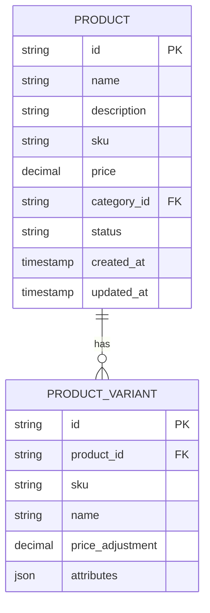
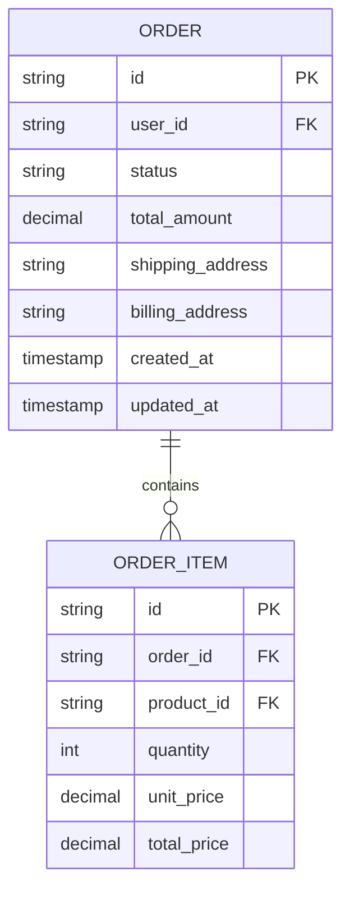

# Data Models

## Core Entities

### User


### 1. Product


### 2. Order


## Data Access Patterns

### User Management
1. **User Operations**:
   - Find user by email/phone
   - Check if email/phone exists
   - Get user profile
   - List users with pagination
   - Search users by criteria

### Authentication
1. **Auth Operations**:
   - Create/update auth methods
   - Verify credentials
   - Manage sessions
   - Handle password resets

### Read Patterns
1. **Product Catalog`:
   - Get product by ID
   - List products by category
   - Search products with filters
   - Get related products

2. **Order Management**:
   - Get order by ID
   - List user orders
   - Get order status

### Write Patterns
1. **Product Management**:
   - Create/Update product
   - Update inventory
   - Bulk import products

2. **Order Processing**:
   - Create order
   - Update order status
   - Process payment

## Data Flow
1. **Product Data Flow**:
   ```
   Admin Portal -> Product Service -> Database
   ```

2. **Order Data Flow**:
   ```
   Customer -> API Gateway -> Order Service -> Payment Service -> Order DB
   ```

## Data Validation Rules
1. **Product**:
   - Price must be positive
   - SKU must be unique
   - Required fields: name, price, category

2. **Order**:
   - Total must match sum of items
   - Required shipping/billing info
   - Valid status transitions

## Data Migration Strategy
1. **Versioning**:
   - Schema versioning for backward compatibility
   - Zero-downtime migrations

2. **Backup & Recovery**:
   - Daily backups
   - Point-in-time recovery
   - Test restoration procedures
