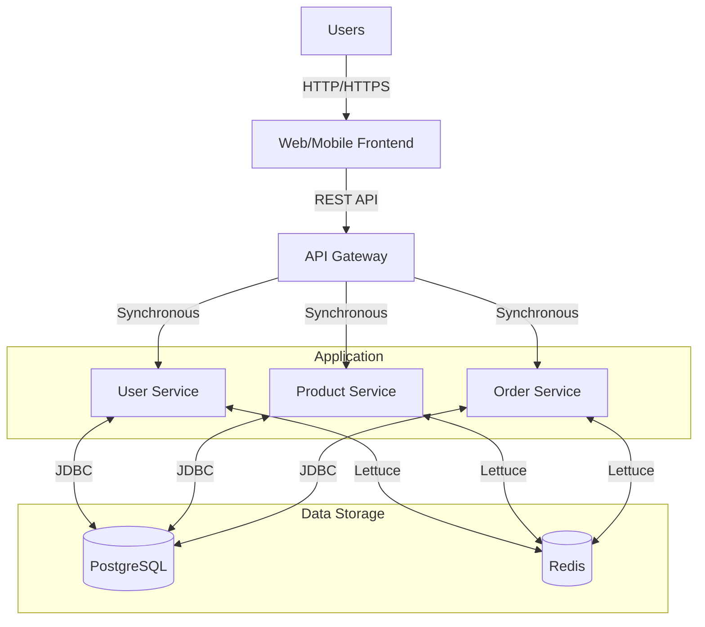

# System Architecture Patterns

## Architectural Style
- **Modular Monolith with Bounded Contexts**: Cohesive modules with clear boundaries
- **Synchronous Communication**: Direct method calls within the same process
- **Layered Architecture**: Presentation, Service, Repository, and Database layers
- **API-First Approach**: Well-defined contracts for all external interfaces

## Context Diagram

## Design Patterns

### Data Access
- **Repository Pattern**: Type-safe data access with `BaseRepository`
- **Unit of Work**: Transaction management with `@Transactional`
- **Data Mapper**: Map between database rows and domain objects

### Behavioral
- **Strategy Pattern**: For interchangeable algorithms (e.g., authentication providers)
- **Template Method**: In `BaseRepository` for common CRUD operations
- **Decorator**: For adding cross-cutting concerns (caching, retries)

### Concurrency
- **Optimistic Locking**: For concurrent updates
- **Pessimistic Locking**: Via `LockService` for critical sections
- **Retry Pattern**: For transient failures in database operations

## Quality Attributes
- **Scalability**: Vertical scaling with connection pooling (HikariCP)
- **Availability**: 99.9% uptime with retry mechanisms
- **Performance**: 
  - < 500ms for database queries (p95)
  - < 50ms for cache hits
  - Connection pooling for reduced latency
- **Security**: 
  - Passwordless authentication
  - Input validation
  - SQL injection prevention via parameterized queries
- **Resilience**:
  - Retry on transient failures
  - Circuit breakers for external services
  - Timeouts on all external calls

## Cross-Cutting Concerns
- **Logging**: 
  - Structured logging with MDC for request tracing
  - Correlation IDs for request tracking
  - Sensitive data redaction

- **Monitoring**:
  - Metrics for database query performance
  - Cache hit/miss ratios
  - Lock acquisition times
  - Error rates and types

- **Caching**:
  - Redis for:
    - Session storage
    - Rate limiting
    - Distributed locks
    - Frequently accessed data
  - Eviction policies: LRU with TTL

- **Database**:
  - Connection pooling with HikariCP
  - Read replicas for read-heavy operations
  - Automatic retry for transient failures
  - Connection validation on checkout

- **Error Handling**:
  - Consistent error responses
  - Retryable vs non-retryable errors
  - Circuit breakers for dependent services
  - Dead letter queues for failed operations
